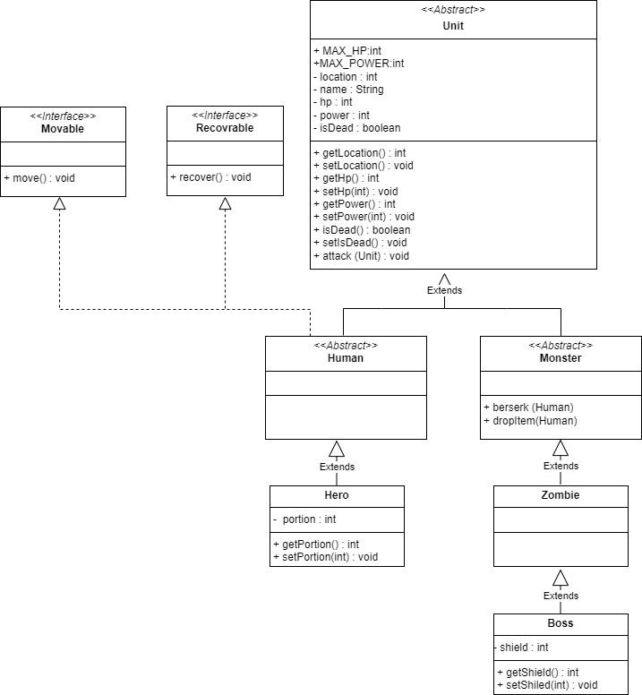

# 다형성 좀비 콘솔 게임

> 소개
> 
  평화로운 마을에 좀비들이 출몰한다는 제보가 들려오자 마을을 구하기위해 용사는 숲으로 모험을 떠나게 된다.

> 게임에 대한 컨셉 및 플레이 설명
* 게임의 컨셉
  * 용사는 좀비를 무찌르고 마을의 평화를 지키기 위해 모험을 떠납니다.
  * 마을에서 멀리 떨어질수록 강한 좀비들이 나오게 됩니다.
  * 좀비들은 체력이 떨어지면 광폭화를 사용해 용사에게 더 큰 데미지를 주는데, 용사는 포션을 사용하여 피가 0이 되지않도록 체력을 회복하며 싸움을 진행합니다.
    
* 플레이 설명
  * 조작 방법
    * 각 상황에 맞는 버튼을 누르면 게임이 진행된다.
    * 종료하기를 선택하면 즉시 게임이 종료된다.
    * 전진하기를 선택하면 좀비들이 나타나는 숲으로 점점 앞으로 나아간다.
    * 공격하기를 누르면 좀비를 공격한다.
    * 회복하기를 누르면 체력을 회복한다.

  * 전투모드
    * 좀비가 리스폰되는 위치에 도달하면 좀비와의 전투가 시작된다.
    * 좀비와의 전투중에는 공격하기와 회복하기를 사용 할 수 있다.
    * 공격하기를 사용하면 좀비에게 데미지를 가하고, 본인도 데미지를 입게된다.
    * 체력이 100 이하일때 회복하기를 사용하면 포션을 하나 사용하여 체력을 100 회복하게 된다.
    * 좀비를 죽이면 전투에서 승리하고 전투가 종료된다.

  * 종료 조건
    * 종료하기를 누르면 즉시 게임이 종료된다.
    * 용사의 체력이 0이 되면 즉시 게임이 종료된다.
    * 모든 좀비를 처치하고 마지막 지점 (10단계)에 도달하면 게임 승리와 동시에 종료된다.

> 캐릭터 설명
* 캐릭터
    * 용사
        * 200의 체력, 최대 20의 파워를 가지고 있다.
    * 일반 좀비
        * 100의 체력, 최대 10의 파워를 가지고 있다.
    * 보스 좀비
        * 300의 체력, 최대 20의 파워를 가지고 잇다.
        * 50의 쉴드를 가지고 있다.

* 스킬 설명
    * 용사
        * 공격시 0~20의 데미지를 가한다.
        * 체력 100 이하일때 체력회복이 가능하다.
    * 일반 좀비
        * 공격 시 0 ~ 10의 데미지를 가한다
        * 광폭화 시 1/3 확률로 추가타가 나가게 된다.
    * 보스 좀비
        * 공격시 0 ~ 20의 데미지를 가한다.
        * 광폭화 시 2배의 데미지를 가하게 된다.
    
    

> Class Diagram

> Demo

